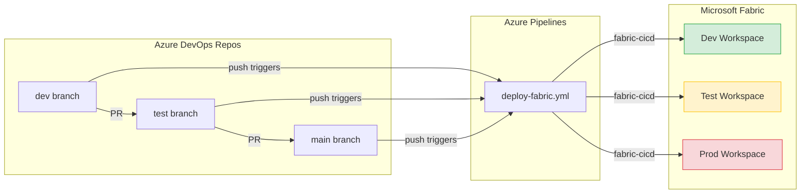

# Azure DevOps Demo — Fabric CI/CD with Git-Based Deployments

Step-by-step guide to demo the full CI/CD flow using **Azure DevOps** as the repository host and **Azure Pipelines** as the pipeline engine.

> **Time estimate:** ~30 min for first-time setup, ~10 min for repeat demos.

---

## Architecture



---

## Prerequisites

| # | Requirement | Details |
|---|---|---|
| 1 | **Azure DevOps organization** | With a project to host the repo |
| 2 | **Microsoft Fabric** | 3 workspaces: Dev, Test, Prod (Trial, Premium, or Fabric capacity) |
| 3 | **Azure Entra ID App Registration** | Service Principal with Fabric API permissions |
| 4 | **Azure subscription** | For creating the Service Connection |
| 5 | **Fabric workspace access** | The Service Principal must be added as a **Member** or **Admin** in each workspace |

---

## Step 1 — Import the Repository into Azure DevOps

1. Go to your Azure DevOps project → **Repos** → **Import a repository**.
2. Clone URL: `https://github.com/samueltauil/powerbi-git-demo.git`
3. Click **Import**.
4. Clone locally:

   ```bash
   git clone https://dev.azure.com/<org>/<project>/_git/powerbi-git-demo
   cd powerbi-git-demo
   ```

---

## Step 2 — Create the Branch Structure

Create `dev` and `test` branches from `main`:

```bash
git checkout -b dev
git push -u origin dev

git checkout -b test
git push -u origin test

git checkout main
```

---

## Step 3 — Create the Azure Entra ID App Registration

> Same as the GitHub demo — if you already have one, skip to Step 4.

1. Go to the [Azure Portal](https://portal.azure.com) → **Microsoft Entra ID** → **App registrations** → **New registration**.
2. Name: `Fabric CI/CD`.
3. Supported account type: **Single tenant**.
4. Click **Register**.
5. Note the **Application (client) ID** and **Directory (tenant) ID**.
6. Go to **Certificates & secrets** → **New client secret** → copy the **Value** (shown only once).

> **Note:** Fabric REST APIs authorize via **workspace role**, not Microsoft Graph permissions. Workspace access is granted below. The Fabric tenant admin must also enable **"Service principals can use Fabric APIs"** in the Fabric Admin portal.

### Add the Service Principal to Fabric Workspaces

For each workspace (Dev, Test, Prod):

1. Open the workspace in [app.fabric.microsoft.com](https://app.fabric.microsoft.com).
2. Click **Manage access** → **Add people or groups**.
3. Search for `Fabric CI/CD` (your App Registration).
4. Assign the **Member** role.
5. Click **Add**.

---

## Step 4 — Create an Azure DevOps Service Connection

1. Go to **Project Settings** → **Service connections** → **New service connection**.
2. Select **Azure Resource Manager** → **Service principal (manual)**.
3. Fill in:
   - **Subscription ID / Name**: your Azure subscription
   - **Service Principal ID**: the App Registration client ID
   - **Service Principal Key**: the client secret
   - **Tenant ID**: your Entra ID tenant ID
4. Service connection name: `fabric-service-connection` (must match the `azureSubscription` value in [`azure-pipelines/deploy-fabric.yml`](../azure-pipelines/deploy-fabric.yml)).
5. Check **Grant access permission to all pipelines**.
6. Click **Verify and save**.

---

## Step 5 — Create the Variable Group

1. Go to **Pipelines** → **Library** → **+ Variable group**.
2. Name: `Fabric-Deploy` (must match the `group:` reference in the pipeline YAML).
3. Add variables:

| Variable Name | Value | Keep Secret? |
|---|---|---|
| `DEV_WORKSPACE_ID` | Dev workspace GUID | No |
| `TEST_WORKSPACE_ID` | Test workspace GUID | No |
| `PROD_WORKSPACE_ID` | Prod workspace GUID | No |
| `TEST_CONNECTION_ID` | Fabric connection GUID for the **Test** semantic model | Yes |
| `PROD_CONNECTION_ID` | Fabric connection GUID for the **Prod** semantic model | Yes |

4. Click **Save**.

> **Finding your workspace ID:** Open the workspace in Fabric — the URL contains the workspace ID:
> `https://app.fabric.microsoft.com/groups/<workspace-id>/...`

> **Finding a connection ID:** Fabric portal → **Settings** → **Manage connections and gateways** → select the connection → copy the **Connection ID**.

> **Tip:** For sensitive values you can also link the variable group to an Azure Key Vault.

---

## Step 6 — Create the Pipeline

1. Go to **Pipelines** → **New pipeline**.
2. Select **Azure Repos Git** → select `powerbi-git-demo`.
3. Select **Existing Azure Pipelines YAML file**.
4. Branch: `main`, Path: `/azure-pipelines/deploy-fabric.yml`.
5. Click **Continue** → **Save** (do not run yet — finish Step 7 first).
6. On first run the pipeline will request permission to use the `Fabric-Deploy` variable group and the `fabric-service-connection` — click **Permit**.

---

## Step 7 — Update parameter.yml

The repo ships [parameter.yml](../parameter.yml) with a placeholder DEV connection ID (`00000000-0000-0000-0000-000000000000`) and the tokens `__TEST_CONNECTION_ID__` / `__PROD_CONNECTION_ID__`. The pipeline replaces the tokens at deploy time using the variable group values from Step 5.

Replace the `find_value` with your **DEV** connection GUID:

```yaml
find_replace:
    - find_value: "<your-dev-connection-guid>"   # the connection ID used by the DEV semantic model
      replace_value:
          TEST: "__TEST_CONNECTION_ID__"          # replaced by the pipeline at runtime
          PROD: "__PROD_CONNECTION_ID__"          # replaced by the pipeline at runtime
      item_type: "SemanticModel"
```

> **Important:** Only commit the **DEV** connection GUID. The TEST and PROD values are injected at runtime from the `Fabric-Deploy` variable group — never commit real connection IDs for those environments.

Commit and push to `dev`:

```bash
git checkout dev
# edit parameter.yml
git add parameter.yml
git commit -m "Configure parameter overrides for environments"
git push
```

---

## Demo Walkthrough

### Demo 1 — Deploy to Dev

1. Make a change (e.g., edit a measure in [`My new report.SemanticModel/definition/tables/Sales.tmdl`](../My%20new%20report.SemanticModel/definition/tables/Sales.tmdl)).
2. Commit and push to `dev`:

   ```bash
   git checkout dev
   # make your change
   git add .
   git commit -m "Add new measure to Sales"
   git push
   ```

3. Go to **Pipelines** in Azure DevOps — the pipeline run starts automatically.
4. The pipeline resolves `DEV_WORKSPACE_ID` from the variable group and deploys via `fabric-cicd` with `environment=DEV`.
5. Open the **Dev** workspace in Fabric and verify the change.

### Demo 2 — Promote to Test

1. Go to **Repos** → **Pull requests** → **New pull request**.
2. Source: `dev` → Target: `test`.
3. Review and **Complete** the PR (this pushes to `test`).
4. The push triggers the pipeline on `test` with `environment=TEST`.
5. The pipeline runs `sed` to swap `__TEST_CONNECTION_ID__` in `parameter.yml`, then deploys to the **Test** workspace.
6. Open the **Test** workspace in Fabric and verify the semantic model now points to the **Test** connection.

### Demo 3 — Promote to Prod

1. Create a PR from `test` → `main`.
2. Review and **Complete** the PR.
3. The pipeline deploys to the **Prod** workspace with `environment=PROD`.

### Key talking point

> "Notice we never changed any connection strings or URLs in the PR. The `parameter.yml` file tells `fabric-cicd` to swap environment-specific values at deployment time. The source files always stay in their dev state."

---

## Troubleshooting

| Problem | Solution |
|---|---|
| Pipeline not triggering | Confirm the YAML exists on the target branch and the `trigger:` block lists `dev`/`test`/`main`. |
| `ModuleNotFoundError: fabric_cicd` | Ensure `requirements.txt` is present and lists `fabric-cicd`. |
| Service connection auth failure | Verify the SPN credentials and that it has **Member** access to the Fabric workspaces. |
| `Variable group 'Fabric-Deploy' could not be found` | Ensure the variable group exists and authorize it for the pipeline (first run prompts for permission). |
| `Invalid workspace_id` | Variable values must contain only the GUID (no URL prefix). |
| Parameter overrides not applied | Verify `parameter.yml` is in the repo root, the DEV `find_value` matches the actual DEV connection ID, and environment names are `DEV` / `TEST` / `PROD` (uppercase). |
| Tokens (`__TEST_CONNECTION_ID__`) appear in deployed model | The matching variable is missing or empty in the `Fabric-Deploy` variable group. |

---

## File Reference

| File | Purpose |
|---|---|
| [azure-pipelines/deploy-fabric.yml](../azure-pipelines/deploy-fabric.yml) | Azure Pipelines YAML — triggers on push to `dev`/`test`/`main` |
| [.deploy/fabric_workspace.py](../.deploy/fabric_workspace.py) | Python deployment script using `fabric-cicd` |
| [parameter.yml](../parameter.yml) | Environment-specific value overrides |
| [requirements.txt](../requirements.txt) | Python dependencies |
