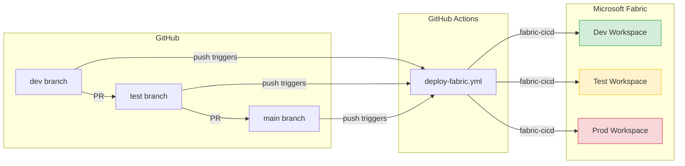

# GitHub Demo — Fabric CI/CD with Git-Based Deployments

Step-by-step guide to demo the full CI/CD flow using **GitHub** as the repository host and **GitHub Actions** as the pipeline engine.

> **Time estimate:** ~30 min for first-time setup, ~10 min for repeat demos.

---

## Architecture



---

## Prerequisites

| # | Requirement | Details |
|---|---|---|
| 1 | **GitHub account** | With a fork of `samueltauil/powerbi-git-demo` |
| 2 | **Microsoft Fabric** | 3 workspaces: Dev, Test, Prod (Trial, Premium, or Fabric capacity) |
| 3 | **Azure Entra ID App Registration** | Service Principal with Fabric API permissions |
| 4 | **Fabric workspace access** | The Service Principal must be added as a **Member** or **Admin** in each workspace |

---

## Step 1 — Fork the Repository

1. Go to [github.com/samueltauil/powerbi-git-demo](https://github.com/samueltauil/powerbi-git-demo).
2. Click **Fork** → select your account → **Create fork**.
3. Clone your fork locally:

   ```bash
   git clone https://github.com/<your-username>/powerbi-git-demo.git
   cd powerbi-git-demo
   ```

---

## Step 2 — Create the Branch Structure

Create `dev` and `test` branches from `main`:

```bash
git checkout -b dev
git push -u origin dev

git checkout -b test
git push -u origin test

git checkout main
```

You now have three long-lived branches: `dev`, `test`, `main`.

---

## Step 3 — Create the Azure Entra ID App Registration

1. Go to the [Azure Portal](https://portal.azure.com) → **Microsoft Entra ID** → **App registrations** → **New registration**.
2. Name: `Fabric CI/CD`.
3. Supported account type: **Single tenant**.
4. Click **Register**.
5. Note the **Application (client) ID** and **Directory (tenant) ID**.
6. Go to **Certificates & secrets** → **New client secret** → copy the **Value** (shown only once).

> **Note:** Fabric REST APIs authorize via **workspace role**, not Microsoft Graph permissions. The actual access is granted in Step 3b below. The Fabric tenant admin must also enable **"Service principals can use Fabric APIs"** in the Fabric Admin portal.

### Step 3b — Add the Service Principal to Fabric Workspaces

For **each** workspace (Dev, Test, Prod):

1. Open the workspace in [app.fabric.microsoft.com](https://app.fabric.microsoft.com).
2. Click **Manage access** → **Add people or groups**.
3. Search for your App Registration name (`Fabric CI/CD`).
4. Assign the **Member** role.
5. Click **Add**.

---

## Step 4 — Configure GitHub Environments and Secrets

### 4a. Create three GitHub Environments

1. Go to your fork → **Settings** → **Environments** → **New environment**.
2. Create three environments named exactly: `DEV`, `TEST`, `PROD`.

### 4b. Add secrets to each environment

The workflow resolves the environment from the branch name (`dev` → `DEV`, `test` → `TEST`, `main` → `PROD`) and only loads the secrets for that environment.

**All three environments (`DEV`, `TEST`, `PROD`) need:**

| Secret Name | Value |
|---|---|
| `AZURE_CLIENT_ID` | App Registration client ID |
| `AZURE_CLIENT_SECRET` | App Registration client secret |
| `AZURE_TENANT_ID` | Entra ID tenant ID |
| `FABRIC_WORKSPACE_ID` | The target Fabric workspace GUID **for that environment** |

**Additionally, only on the matching environment:**

| Environment | Extra Secret | Value |
|---|---|---|
| `TEST` | `TEST_CONNECTION_ID` | Connection GUID used by the semantic model in the **Test** workspace |
| `PROD` | `PROD_CONNECTION_ID` | Connection GUID used by the semantic model in the **Prod** workspace |

> **Finding your workspace ID:** Open the workspace in Fabric — the URL contains the GUID:
> `https://app.fabric.microsoft.com/groups/<workspace-id>/...`

> **Finding a connection ID:** Fabric portal → **Settings** → **Manage connections and gateways** → select the connection → copy the **Connection ID**.

---

## Step 5 — Update parameter.yml

The repo ships [parameter.yml](../parameter.yml) with a placeholder DEV connection ID (`00000000-0000-0000-0000-000000000000`) and the tokens `__TEST_CONNECTION_ID__` / `__PROD_CONNECTION_ID__`. The workflow replaces the tokens at deploy time using the secrets from Step 4b.

Replace the `find_value` with your **DEV** connection GUID:

```yaml
find_replace:
    - find_value: "<your-dev-connection-guid>"   # the connection ID used by the DEV semantic model
      replace_value:
          TEST: "__TEST_CONNECTION_ID__"          # replaced by the workflow at runtime
          PROD: "__PROD_CONNECTION_ID__"          # replaced by the workflow at runtime
      item_type: "SemanticModel"
```

> **Important:** Only commit the **DEV** connection GUID. TEST and PROD values are injected from GitHub Secrets — never commit real connection IDs for those environments.

Commit and push to `dev`:

```bash
git checkout dev
# edit parameter.yml
git add parameter.yml
git commit -m "Configure parameter overrides for environments"
git push
```

---

## Demo Walkthrough

### Demo 1 — Deploy to Dev

1. Make a change (e.g., edit a measure in [`My new report.SemanticModel/definition/tables/Sales.tmdl`](../My%20new%20report.SemanticModel/definition/tables/Sales.tmdl)).
2. Commit and push to `dev`:

   ```bash
   git checkout dev
   # make your change
   git add .
   git commit -m "Add new measure to Sales"
   git push
   ```

3. Open the **Actions** tab in GitHub — the `Deploy to Fabric Workspace` run starts automatically.
4. The workflow targets the `DEV` environment and deploys via `fabric-cicd` with `environment=DEV`.
5. Open the **Dev** workspace in Fabric and verify the change.

### Demo 2 — Promote to Test

1. In GitHub, open a PR from `dev` → `test`.
2. Review and **merge** the PR (this pushes to `test`).
3. The push triggers the workflow on the `test` branch with the `TEST` environment.
4. The workflow swaps `__TEST_CONNECTION_ID__` in `parameter.yml`, then deploys.
5. Open the **Test** workspace and verify the change — note the semantic model now points to the **Test** connection.

### Demo 3 — Promote to Prod

1. Open a PR from `test` → `main`.
2. Review and merge.
3. The workflow runs against the `PROD` environment and deploys to the **Prod** workspace.

### Key talking point

> "Notice we never changed any connection strings or URLs in the PR. The `parameter.yml` file tells `fabric-cicd` to swap environment-specific values at deployment time. The source files always stay in their dev state."

---

## Troubleshooting

| Problem | Solution |
|---|---|
| Workflow not triggering | Confirm the workflow file exists on the target branch and that the branch is `dev`, `test`, or `main`. |
| `ModuleNotFoundError: fabric_cicd` | Ensure `requirements.txt` is present and lists `fabric-cicd`. |
| Authentication failure | Verify the SPN has **Member** access to the target workspace and that all `AZURE_*` and `FABRIC_WORKSPACE_ID` secrets are set in the **correct** GitHub Environment. |
| `Invalid workspace_id` | The `FABRIC_WORKSPACE_ID` secret must contain only the GUID (no URL prefix). |
| Parameter overrides not applied | Verify `parameter.yml` is in the repo root, the DEV `find_value` matches the actual DEV connection ID, and environment names are `DEV` / `TEST` / `PROD` (uppercase). |
| Tokens (`__TEST_CONNECTION_ID__`) appear in deployed model | The matching `TEST_CONNECTION_ID` / `PROD_CONNECTION_ID` secret is missing from the resolved environment. |

---

## File Reference

| File | Purpose |
|---|---|
| [.github/workflows/deploy-fabric.yml](../.github/workflows/deploy-fabric.yml) | GitHub Actions workflow — triggers on push to `dev`/`test`/`main` |
| [.deploy/fabric_workspace.py](../.deploy/fabric_workspace.py) | Python deployment script using `fabric-cicd` |
| [parameter.yml](../parameter.yml) | Environment-specific value overrides |
| [requirements.txt](../requirements.txt) | Python dependencies |
